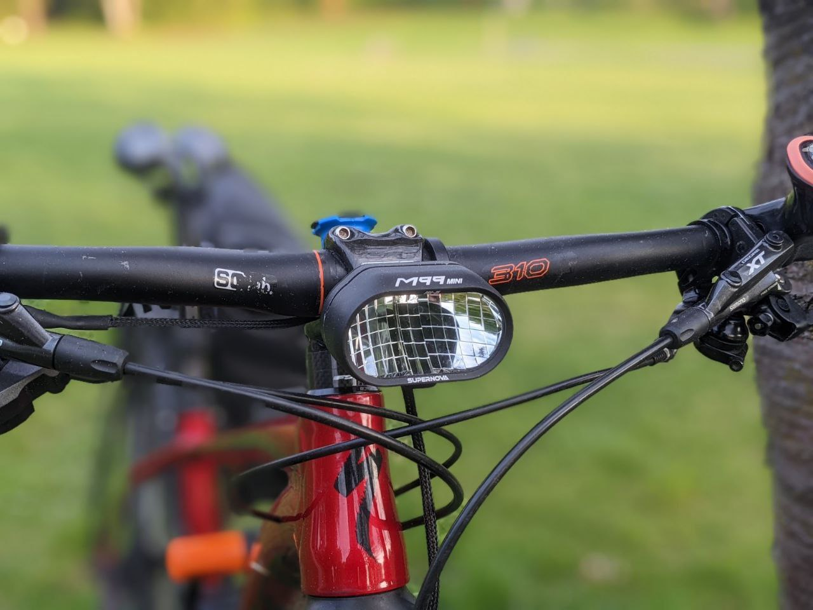
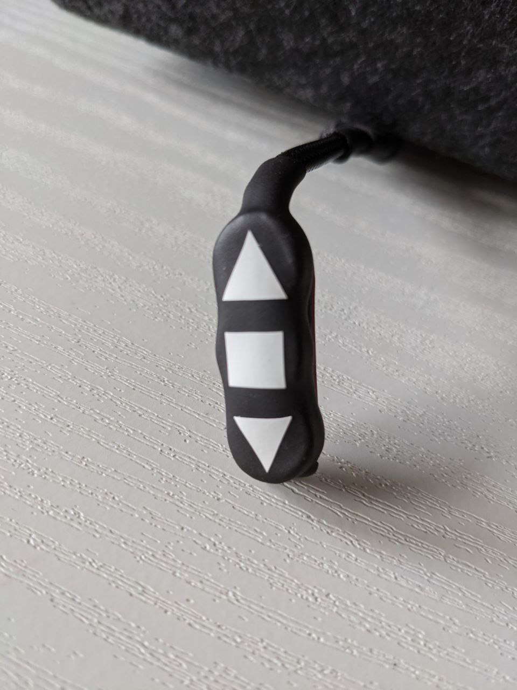
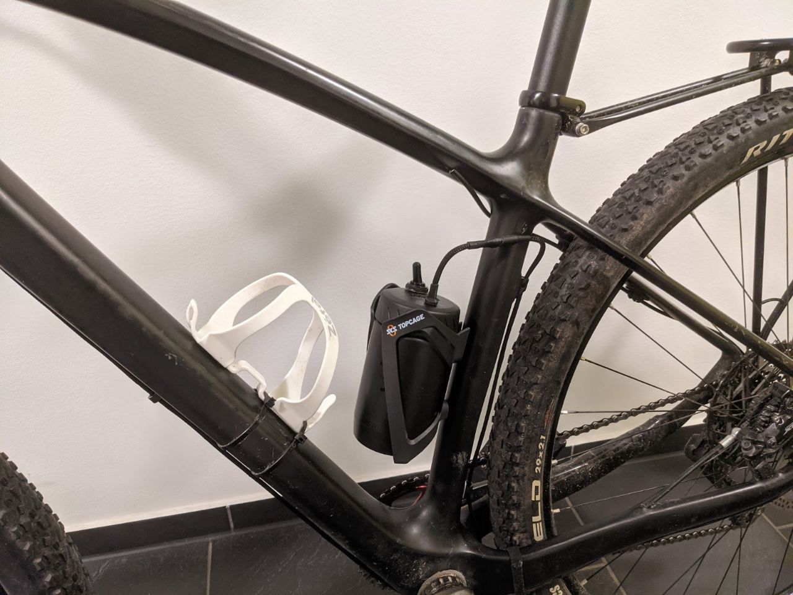

# rusty-light

Awesome flashlight firmware written in Rust and some instructions on how to build hardware for it



## Premium lamps to rival

There are many lamps on the market, but real good ones are made by german companies Lupine and Supernova.
These are premium manufacturers adhering to strict StVZO regulations, which mandate a sharp cutoff of the
low beam.

[Lupine SL X](https://www.lupine.de/products/e-bike-lights/sl-x/sl-x-(25km-h)) which has 9W low beam and 22W high beam.

[Supernova M99 Mini Pro](https://r2-bike.com/SUPERNOVA-Front-Light-M99-Mini-PRO-B54-Black-Edition-with-Battery-Pack-StVZO)
which has 5W low beam and 16W high beam.

## Why build your own flashlight?

It is not going to be cheaper or brighter than premium lights you can buy. So why bother?

The main reason is for fun. Building a light is challenging and rewarding.

The second reason it to achieve higher power, efficiency and allow precise power output
control. Common light do not offer changing the brightness, you will always be running on full power.
By having precise control over the power output you can be running the light at the optimal brightness depending on the
conditions.

Also, lights from Lupine and Supernova are constrained in size and cost of driver components.
This doesn't allow them to use large and efficient coils. Efficiency increase from using good drivers can be as large
as 30%.

## Modular concept

The light is not isolated, it has to be integrated with the bike, needs a battery, a remote control and,
ideally, a companion rear light. You even connect bicycle trailer lights to the same battery.
Microcontroller board and drivers are quite large and don't fit in the small heat sink.

I am quite satisfied with my current modular setup. The light itself is mounted in from of the handlebar using
a Supernova mount. A thin cable exits the heat sink, goes underneath the handlebar and connects to the remote control,
which is mounted near the right grip. Thick wired covered in a PVC cable sleeve goes downward and enters the steerer
tube from the bottom. The steerer tube hosts the microcontroller board and LED drivers.
The battery is enclosed in a small tool bottle, which is located in the bottle cage. The battery module has
a battery indicator and the master switch. The battery is connected to the steerer tube with a long cable routed
alongside the rear brake hose.

In addition to the front light, I have a Lupine C14 light at the rear connected to the same battery and a port
to connect a bike trailer.

This way you have only one switch to switch the whole thing on and off, batteries are easily replaceable and can
be taken out for charging or removed during day rides.




## Low tech

Building a neat remote control, cables, connectors and the battery module can sound challenging, but actually
it is pretty easy. I use XT30 connectors for everything. Cables are tied together with PVC sleeves and everything
is secured with heatshrink tubes.

For the remote control you will need some SMD buttons, plastic circles to put on top of these buttons and some
heatshrink tube as watertight enclosure. You will need a basic soldering iron, scissors and a lighter to shrink
the tubes.

## Hardware

[STM32 Nucleo-32 boards (MB1180)](https://www.st.com/resource/en/user_manual/dm00231744-stm32-nucleo32-boards-mb1180-stmicroelectronics.pdf)
boards to control the drivers.

### LEDs

LEDs should ideally be coupled with a reflector.
For this you can buy a used M99 Mini Pro 25, which a trimmed down version, but spots the same reflector and LEDs.
You can get a new one for 200€ or find a used or broken one for less than a 100€.

Alternatively, you can use Cree XP-G or Cree XP-L or 3-up stars with collimator optics or a combination of both
(a small reflector for low beam and collimator optics for the high beam).

### LED drivers

Low and high beam LEDs require an independent LED driver each.
Drivers are controlled with PWM and drive LEDs with constant current.
Depending on the LED setup, you can use boost drivers with 3+ LEDs in series or buck drivers with 1-2 LEDs in series.

I
use [Led Senser V2](https://www.ledtreiber.de/shop/Led-Senser-V2-R-2-%E2%80%A2-100-1350mA-%E2%80%A2-2-6V~18V-p164952213)
to drive 5 Osram Oslon Compact CL LEDs connected in series.

## Costs

Building a decent light will cost a fortune. The most expensive part are the LEDs, reflector and the heat sink.

| Part                          | Price    |
|-------------------------------|----------|
| LEDs, reflector and heat sink | 100-200€ |
| Drivers                       | 25€ x 2  |
| Battery                       | 50€      |
| Controller                    | 20€      |
| Wires, connectors             | 20€      |
| Case                          | 10€      |
| Total                         | 250-350€ |

Comparable lights cost 580€ from [Lupine](https://www.lupine.de/products/bike-lights/road-bike-lights/sl-ax)
and 577€
from [Supernova](https://r2-bike.com/SUPERNOVA-Front-Light-M99-Mini-PRO-B54-Black-Edition-with-Battery-Pack-StVZO).

While it might sound like a good deal (50% less), if you factor in the time needed to build the light,
the price will go up.

## Building and running

Following flashes the [stm32-nucleo](stm32-nucleo/README.md) board.

Prerequisites:
[JLink](https://www.segger.com/downloads/jlink/)

```
rustup target add thumbv6m-none-eabi
cargo install cargo-binutils
rustup component add llvm-tools-preview
```

Build and flash:

```
cargo build --manifest-path=stm32-nucleo/Cargo.toml --target=thumbv6m-none-eabi
cargo objcopy --target=thumbv6m-none-eabi --bin stm32-nucleo -- -O ihex stm32-nucleo.hex
/usr/bin/JLinkExe -CommandFile command_file.jlink
```

or simply `./flash.sh`

## Console sim

```
sudo apt install libx11-dev
cargo run --bin console_sim
```